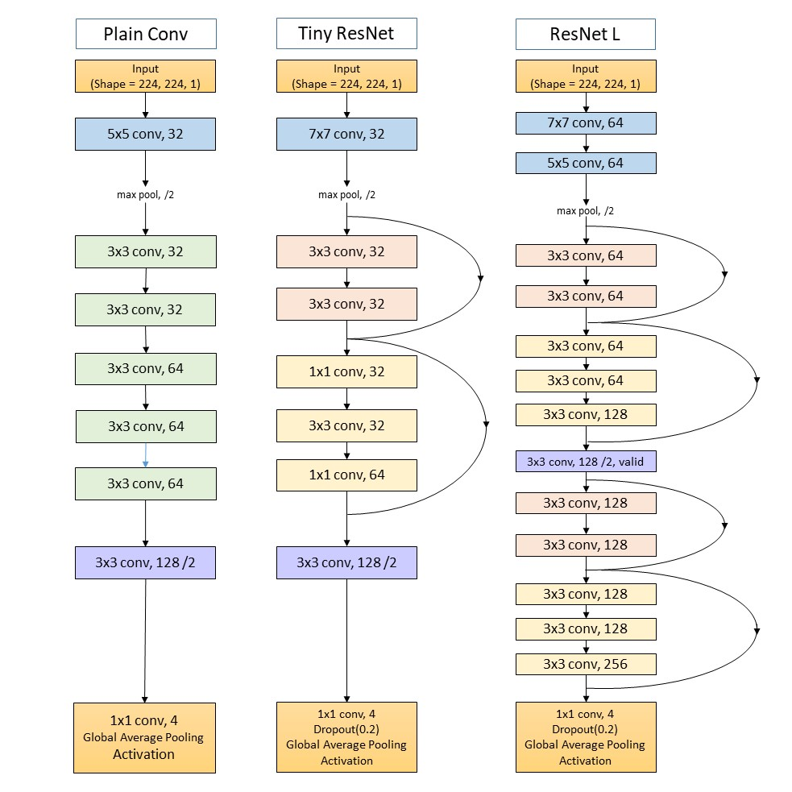

# Classification of blinding retinal diseases
## Classification of blinding retinal diseases using Residual Learning and Convolutional Layers

- To download image data and checkpoints: https://drive.google.com/open?id=1aDKW6FIKmy6q_EcvuqvnhTryX8K0fK6a
- Credit Image Set = https://www.kaggle.com/paultimothymooney/kermany2018/data#

In this project I compared three neural networks for classifying retinal diseases. The data consists of more than 32 thousand optical coherence tomography (OCT) images of the retina separated equally in four classes across train/val/test datasets. 

### Neural Networks Architecture

 
